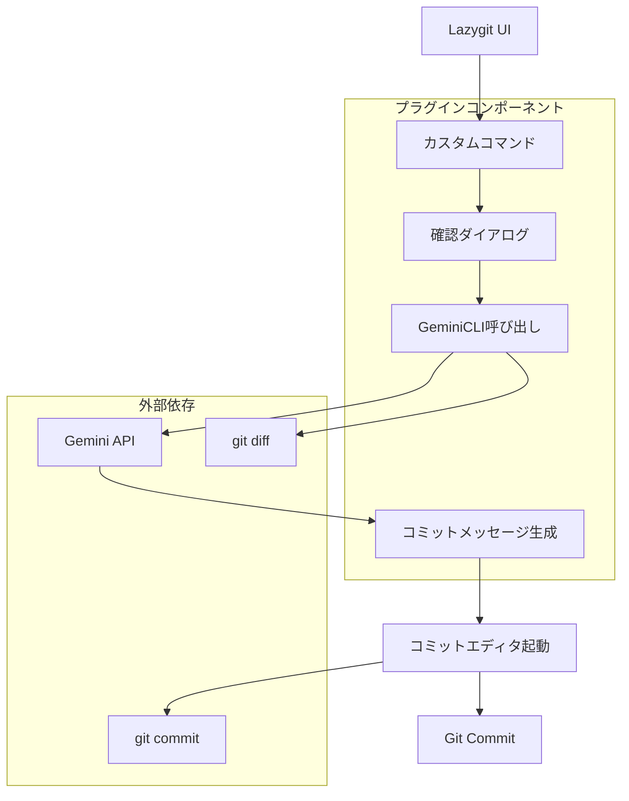
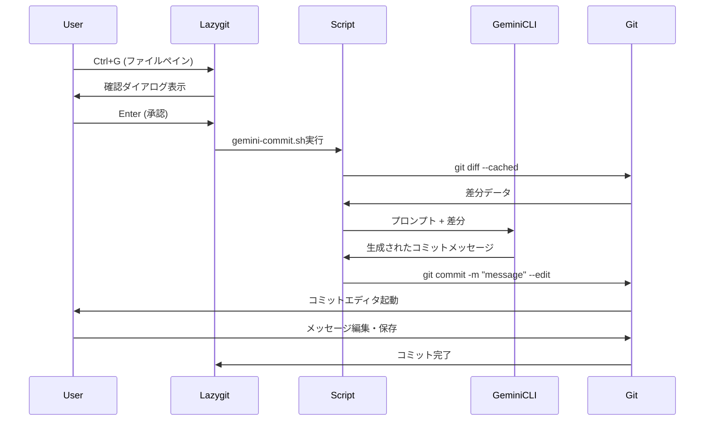

# 設計書

## 概要

LazygitのGeminiCLIコミットメッセージ生成プラグインは、Lazygitのカスタムコマンド機能を使用して実装されます。このプラグインは、ステージングされたファイルの変更内容を分析し、GeminiCLIを通じてAIが生成したコミットメッセージを提供します。

## アーキテクチャ

### システム構成図



### 技術スタック

- **Lazygit**: カスタムコマンド機能
- **GeminiCLI**: AI コミットメッセージ生成
- **Git**: 変更差分取得、コミット実行
- **Shell Script**: プラグインロジック実装
- **YAML**: Lazygit設定ファイル

## コンポーネントと インターフェース

### 1. Lazygitカスタムコマンド設定

#### 設定ファイル構造
```yaml
# ~/.config/lazygit/config.yml
customCommands:
  - key: 'ctrl+g'
    context: 'files'
    description: 'AI コミットメッセージ生成'
    command: '{{.UserConfigDir}}/lazygit/scripts/gemini-commit.sh'
    subprocess: true
    prompts:
      - type: 'confirm'
        title: '生成AIがコミットメッセージを作成します。よろしいですか？'
        body: 'ステージングされた変更を分析してコミットメッセージを生成します。'
```

### 2. メインスクリプト (gemini-commit.sh)

#### インターフェース仕様
```bash
#!/bin/bash
# gemini-commit.sh
# 
# 機能: ステージングされた変更からAIコミットメッセージを生成
# 依存: git, gemini-cli
# 戻り値: 0=成功, 1=一般エラー, 2=設定エラー, 3=依存関係エラー
```

#### 主要関数
- `check_dependencies()`: 依存関係確認
- `validate_staged_files()`: ステージングファイル検証
- `generate_diff_context()`: 差分コンテキスト生成
- `call_gemini_cli()`: GeminiCLI呼び出し
- `open_commit_editor()`: コミットエディタ起動

### 3. GeminiCLI統合モジュール

#### プロンプト設計
```text
あなたは優秀な開発者です。以下のgit diffを分析して、適切なコミットメッセージを生成してください。

要件:
- Conventional Commits形式に従う
- 日本語で記述
- 50文字以内の簡潔な要約行
- 必要に応じて詳細説明を追加
- 変更の意図と影響を明確に表現

Git Diff:
{diff_content}

コミットメッセージ:
```

#### API呼び出し仕様
```bash
# GeminiCLI呼び出し例
gemini-cli \
  --model="gemini-1.5-flash" \
  --temperature=0.3 \
  --max-tokens=200 \
  --prompt-file="$PROMPT_FILE"
```

### 4. エラーハンドリングシステム

#### エラー分類と対応
```bash
# エラーコード定義
readonly ERROR_SUCCESS=0
readonly ERROR_GENERAL=1
readonly ERROR_CONFIG=2
readonly ERROR_DEPENDENCY=3
readonly ERROR_NO_STAGED_FILES=4
readonly ERROR_GEMINI_API=5
readonly ERROR_USER_CANCEL=6
```

## データモデル

### 1. 設定データ構造

```yaml
# プラグイン設定
gemini_commit:
  model: "gemini-1.5-flash"
  temperature: 0.3
  max_tokens: 200
  timeout: 30
  language: "ja"
  commit_format: "conventional"
  
  # プロンプトテンプレート
  prompt_template: |
    あなたは優秀な開発者です。以下のgit diffを分析して、
    適切なコミットメッセージを生成してください。
    
    要件:
    - Conventional Commits形式に従う
    - {language}で記述
    - 50文字以内の簡潔な要約行
    
    Git Diff:
    {diff_content}
```

### 2. 実行時データフロー



## エラーハンドリング

### 1. 依存関係エラー

```bash
check_dependencies() {
    local missing_deps=()
    
    # Git確認
    if ! command -v git >/dev/null 2>&1; then
        missing_deps+=("git")
    fi
    
    # GeminiCLI確認
    if ! command -v gemini-cli >/dev/null 2>&1; then
        missing_deps+=("gemini-cli")
    fi
    
    if [ ${#missing_deps[@]} -gt 0 ]; then
        show_error "必要な依存関係が見つかりません: ${missing_deps[*]}"
        return $ERROR_DEPENDENCY
    fi
    
    return $ERROR_SUCCESS
}
```

### 2. API エラーハンドリング

```bash
call_gemini_cli() {
    local prompt_file="$1"
    local output_file="$2"
    local max_retries=3
    local retry_count=0
    
    while [ $retry_count -lt $max_retries ]; do
        if timeout 30 gemini-cli \
            --model="gemini-1.5-flash" \
            --temperature=0.3 \
            --prompt-file="$prompt_file" \
            > "$output_file" 2>/dev/null; then
            return $ERROR_SUCCESS
        fi
        
        retry_count=$((retry_count + 1))
        show_warning "GeminiCLI呼び出し失敗 (試行 $retry_count/$max_retries)"
        sleep 2
    done
    
    show_error "GeminiCLI呼び出しに失敗しました"
    return $ERROR_GEMINI_API
}
```

### 3. ユーザーフレンドリーなエラーメッセージ

```bash
show_error() {
    local message="$1"
    echo "❌ エラー: $message" >&2
    
    # Lazygit通知として表示
    if [ -n "$LAZYGIT_NOTIFICATION" ]; then
        echo "$message" > "$LAZYGIT_NOTIFICATION"
    fi
}

show_warning() {
    local message="$1"
    echo "⚠️  警告: $message" >&2
}

show_info() {
    local message="$1"
    echo "ℹ️  情報: $message" >&2
}
```

## テスト戦略

### 1. 単体テスト

#### テスト対象関数
- `check_dependencies()`: 依存関係確認
- `validate_staged_files()`: ステージングファイル検証
- `generate_diff_context()`: 差分生成
- `call_gemini_cli()`: API呼び出し
- `sanitize_commit_message()`: メッセージサニタイズ

#### テスト実装例
```bash
#!/bin/bash
# test-gemini-commit.sh

source "$(dirname "$0")/gemini-commit.sh"

test_check_dependencies() {
    # Gitが利用可能な場合
    if command -v git >/dev/null 2>&1; then
        check_dependencies
        assert_equals $? $ERROR_SUCCESS "Git available should pass"
    fi
    
    # GeminiCLIが利用不可能な場合のモック
    PATH="/tmp/empty:$PATH" check_dependencies
    assert_equals $? $ERROR_DEPENDENCY "Missing gemini-cli should fail"
}

test_validate_staged_files() {
    # テスト用リポジトリ作成
    local test_repo=$(mktemp -d)
    cd "$test_repo"
    git init
    
    # ステージングファイルなしの場合
    validate_staged_files
    assert_equals $? $ERROR_NO_STAGED_FILES "No staged files should fail"
    
    # ステージングファイルありの場合
    echo "test" > test.txt
    git add test.txt
    validate_staged_files
    assert_equals $? $ERROR_SUCCESS "Staged files should pass"
    
    # クリーンアップ
    rm -rf "$test_repo"
}
```

### 2. 統合テスト

#### テストシナリオ
1. **正常フロー**: ステージング → AI生成 → コミット
2. **エラーケース**: 依存関係不足、API障害、ユーザーキャンセル
3. **エッジケース**: 大量差分、バイナリファイル、マージコンフリクト

#### 自動テスト環境
```dockerfile
# Dockerfile.test
FROM ubuntu:22.04

# 依存関係インストール
RUN apt-get update && apt-get install -y \
    git \
    curl \
    jq \
    && rm -rf /var/lib/apt/lists/*

# GeminiCLI インストール (モック版)
COPY test/mock-gemini-cli /usr/local/bin/gemini-cli
RUN chmod +x /usr/local/bin/gemini-cli

# テストスクリプト
COPY test/ /test/
COPY gemini-commit.sh /test/

WORKDIR /test
CMD ["./run-tests.sh"]
```

### 3. パフォーマンステスト

#### 測定項目
- API応答時間
- 大量差分処理時間
- メモリ使用量
- 同時実行時の動作

#### ベンチマーク実装
```bash
benchmark_api_response() {
    local iterations=10
    local total_time=0
    
    for i in $(seq 1 $iterations); do
        local start_time=$(date +%s.%N)
        call_gemini_cli "$test_prompt" "$output_file"
        local end_time=$(date +%s.%N)
        
        local duration=$(echo "$end_time - $start_time" | bc)
        total_time=$(echo "$total_time + $duration" | bc)
    done
    
    local avg_time=$(echo "scale=3; $total_time / $iterations" | bc)
    echo "平均API応答時間: ${avg_time}秒"
}
```

## セキュリティ考慮事項

### 1. 入力値サニタイゼーション

```bash
sanitize_diff_content() {
    local diff_content="$1"
    
    # 機密情報パターンの除去
    echo "$diff_content" | \
        sed 's/password[[:space:]]*=[[:space:]]*[^[:space:]]*/password=***REDACTED***/gi' | \
        sed 's/api[_-]key[[:space:]]*=[[:space:]]*[^[:space:]]*/api_key=***REDACTED***/gi' | \
        sed 's/token[[:space:]]*=[[:space:]]*[^[:space:]]*/token=***REDACTED***/gi'
}
```

### 2. 一時ファイル管理

```bash
create_secure_temp_file() {
    local temp_file=$(mktemp)
    chmod 600 "$temp_file"
    
    # 終了時に自動削除
    trap "rm -f '$temp_file'" EXIT
    
    echo "$temp_file"
}
```

### 3. API キー管理

```bash
get_gemini_api_key() {
    # 環境変数から取得
    if [ -n "$GEMINI_API_KEY" ]; then
        echo "$GEMINI_API_KEY"
        return
    fi
    
    # 設定ファイルから取得
    local config_file="$HOME/.config/gemini-cli/config.yaml"
    if [ -f "$config_file" ]; then
        yq eval '.api_key' "$config_file" 2>/dev/null
        return
    fi
    
    show_error "Gemini API キーが設定されていません"
    return $ERROR_CONFIG
}
```

## 設定とカスタマイゼーション

### 1. 設定ファイル構造

```yaml
# ~/.config/lazygit/gemini-commit.yml
gemini:
  model: "gemini-1.5-flash"
  temperature: 0.3
  max_tokens: 200
  timeout: 30
  
commit:
  language: "ja"
  format: "conventional"
  max_diff_size: 10000
  
prompts:
  system: |
    あなたは優秀な開発者です。
    git diffを分析して適切なコミットメッセージを生成してください。
  
  user_template: |
    以下の変更に対するコミットメッセージを{language}で生成してください。
    形式: {format}
    
    変更内容:
    {diff_content}

ui:
  show_progress: true
  confirm_before_commit: true
  editor_command: "${EDITOR:-vim}"
```

### 2. 設定読み込み機能

```bash
load_config() {
    local config_file="$HOME/.config/lazygit/gemini-commit.yml"
    
    # デフォルト設定
    GEMINI_MODEL="gemini-1.5-flash"
    GEMINI_TEMPERATURE="0.3"
    GEMINI_MAX_TOKENS="200"
    GEMINI_TIMEOUT="30"
    COMMIT_LANGUAGE="ja"
    COMMIT_FORMAT="conventional"
    
    # 設定ファイルが存在する場合は読み込み
    if [ -f "$config_file" ]; then
        eval "$(yq eval -o=shell "$config_file" 2>/dev/null || true)"
    fi
}
```

## デプロイメントと配布

### 1. インストールスクリプト

```bash
#!/bin/bash
# install.sh

set -euo pipefail

readonly INSTALL_DIR="$HOME/.config/lazygit"
readonly SCRIPT_DIR="$INSTALL_DIR/scripts"
readonly CONFIG_FILE="$INSTALL_DIR/config.yml"

install_plugin() {
    echo "Lazygit GeminiCLI プラグインをインストールしています..."
    
    # ディレクトリ作成
    mkdir -p "$SCRIPT_DIR"
    
    # スクリプトファイルコピー
    cp gemini-commit.sh "$SCRIPT_DIR/"
    chmod +x "$SCRIPT_DIR/gemini-commit.sh"
    
    # 設定ファイル更新
    update_lazygit_config
    
    echo "インストール完了!"
    echo "Lazygitでファイルペインにて Ctrl+G を押してください。"
}

update_lazygit_config() {
    local temp_config=$(mktemp)
    
    # 既存設定を保持しつつカスタムコマンドを追加
    if [ -f "$CONFIG_FILE" ]; then
        cp "$CONFIG_FILE" "$temp_config"
    else
        echo "customCommands: []" > "$temp_config"
    fi
    
    # カスタムコマンド追加
    yq eval '.customCommands += [{
        "key": "ctrl+g",
        "context": "files",
        "description": "AI コミットメッセージ生成",
        "command": "{{.UserConfigDir}}/lazygit/scripts/gemini-commit.sh",
        "subprocess": true,
        "prompts": [{
            "type": "confirm",
            "title": "生成AIがコミットメッセージを作成します。よろしいですか？",
            "body": "ステージングされた変更を分析してコミットメッセージを生成します。"
        }]
    }]' "$temp_config" > "$CONFIG_FILE"
    
    rm -f "$temp_config"
}

# 依存関係確認
check_dependencies() {
    local missing_deps=()
    
    command -v git >/dev/null 2>&1 || missing_deps+=("git")
    command -v yq >/dev/null 2>&1 || missing_deps+=("yq")
    command -v gemini-cli >/dev/null 2>&1 || missing_deps+=("gemini-cli")
    
    if [ ${#missing_deps[@]} -gt 0 ]; then
        echo "エラー: 以下の依存関係が不足しています:"
        printf "  - %s\n" "${missing_deps[@]}"
        exit 1
    fi
}

main() {
    check_dependencies
    install_plugin
}

main "$@"
```

### 2. アンインストールスクリプト

```bash
#!/bin/bash
# uninstall.sh

readonly INSTALL_DIR="$HOME/.config/lazygit"
readonly SCRIPT_DIR="$INSTALL_DIR/scripts"
readonly CONFIG_FILE="$INSTALL_DIR/config.yml"

uninstall_plugin() {
    echo "Lazygit GeminiCLI プラグインをアンインストールしています..."
    
    # スクリプトファイル削除
    rm -f "$SCRIPT_DIR/gemini-commit.sh"
    
    # 設定からカスタムコマンド削除
    if [ -f "$CONFIG_FILE" ]; then
        yq eval 'del(.customCommands[] | select(.command | contains("gemini-commit.sh")))' \
           -i "$CONFIG_FILE"
    fi
    
    echo "アンインストール完了!"
}

uninstall_plugin
```

この設計により、Lazygitの既存のワークフローに自然に統合され、ユーザーフレンドリーなAIコミットメッセージ生成機能を提供できます。